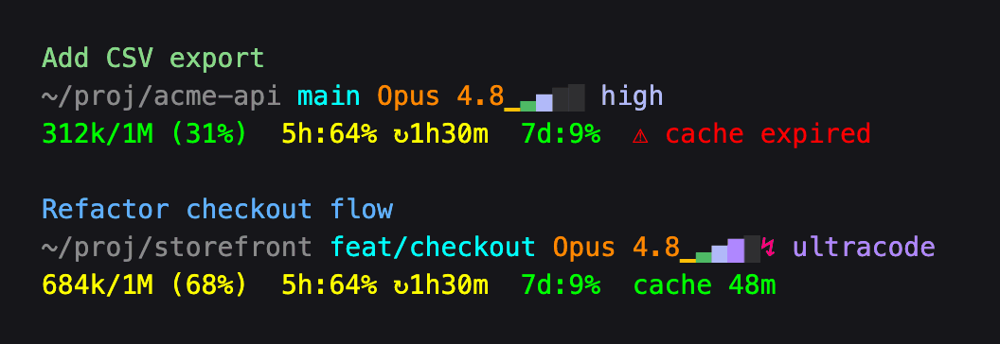

# claude-code-statusline

A lightweight multi-line status line for [Claude Code](https://www.claude.com/product/claude-code): session name, git branch, model, effort level, context window, and 5h / 7d rate limits. One Bash script, nothing to install.



## Why another status line?

Most Claude Code status lines are small apps: a Node package run through `npx`, a compiled binary, a Python daemon, or a shell framework with themes and a config file. That's great if you want a dashboard. This project goes the other way: show the few things you actually glance at, and cost your machine next to nothing.

- **One file.** `statusline.sh` is ~155 lines of Bash and awk plus comments. Read it in ten minutes, change it in place.
- **Fast.** ~7 ms per render on an Apple M4 Pro with the stock macOS bash, ~2 MB peak memory — and ~1.5 ms of that is bash itself starting. A single `awk` pass parses the whole session JSON, and the git branch is read straight from `.git/HEAD`, with no `git` process.
- **Nothing in the background.** No daemon, no cache files, no config file, no network calls, no refresh timer. It runs only when Claude Code asks for a redraw.
- **Uses what Claude Code already sends.** Session name, effort level, context window and rate limits all come from the JSON on stdin — no API calls, no transcript parsing (the one exception: at `xhigh` effort, a fast grep of the transcript to tell ultracode apart).
- **Nothing to install.** Needs only bash, awk and grep, which every macOS and Linux system already has — no `jq`, no Homebrew. Tested with bash 3.2 through 5.3 and the macOS, GNU, mawk and BusyBox awks.

## Install

No dependencies: works out of the box on macOS and Linux.

```bash
git clone https://github.com/TurboKach/claude-code-statusline.git
cd claude-code-statusline
./install.sh
```

The installer **symlinks** `~/.claude/statusline-command.sh` to the cloned `statusline.sh` and points the `statusLine` setting in `~/.claude/settings.json` at it (other settings preserved, a timestamped backup saved alongside). No restart needed — the bar updates on its next render.

Keep the clone around, since the install is a symlink to it. Update with `git pull`.

## What it shows

- **Line 1 — session name.** Your `/rename` name, or Claude's auto-generated session title, colored per project (each launch directory gets a stable hue, so parallel sessions are easy to tell apart). Hidden until the session has a name.
- **Line 2 — where and how.** Working directory, git branch (or short SHA when detached), model name, and an **effort bar**: one cell per reasoning level the model supports (`low · medium · high · xhigh · max` on Opus 4.8), lit up to the active level in Claude Code's own `/effort` colors, followed by the level name. When **ultracode** is active (xhigh effort driving a multi-agent workflow), the bar fills to the `xhigh` cell, a magenta **`↯`** appears after it, and the label reads `ultracode`. The bar hides on models without effort levels.
- **Line 3 — budget.** Context-window usage (`used / max (pct%)`) and the 5-hour / 7-day rate-limit meters, green → yellow at 50% → red at 75%. From 50% a meter adds `↻` and the time until that window resets. Rate limits appear for Claude.ai Pro / Max subscribers after the first response.

## Customize

Everything lives in `statusline.sh`:

- **Project colors** — `proj_hues=(...)`, the 8 ANSI-256 colors assigned per project.
- **Other colors** — the `--- Colors ---` block near the top.

Because the install is a symlink, edits show up on the next render.

## Uninstall

Remove the `statusLine` block from `~/.claude/settings.json` (a timestamped backup sits next to it), then optionally `rm ~/.claude/statusline-command.sh`.

## License

[MIT](LICENSE)
